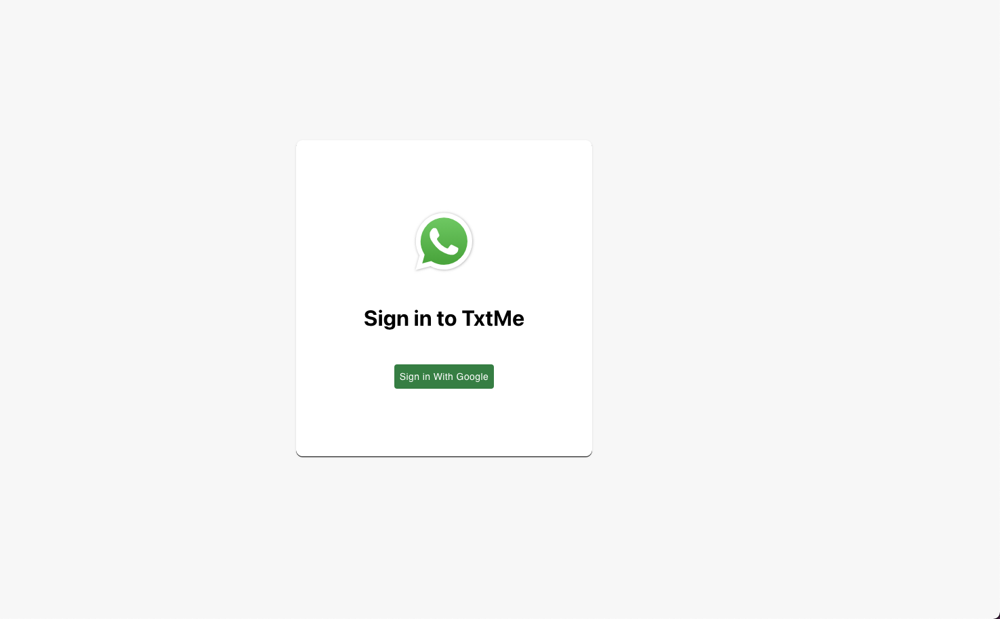

# TxtMe-App

* **Live link:**
https://txtme-app-679f6.web.app/

    

* **Purpose of the App:**
This was a fun individual project to create a simple chat application for users to chat with each others. 

* **Technologies in this build:**
React, Firebase Firestore Realtime Database, Material UI, React Router, React Context API(Redux), and Google Authentication

* **Screenshot of the Login Page using Google Authentication:**

* **Screenshot of adding a chatroom:**

* **Screenshots of the chat rooms and the chats:**
 

